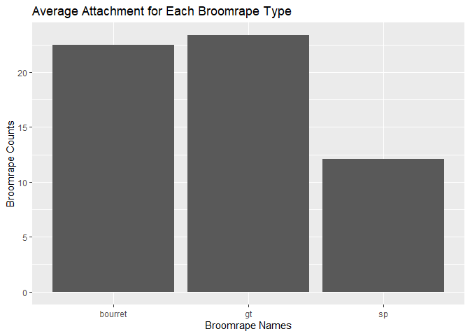
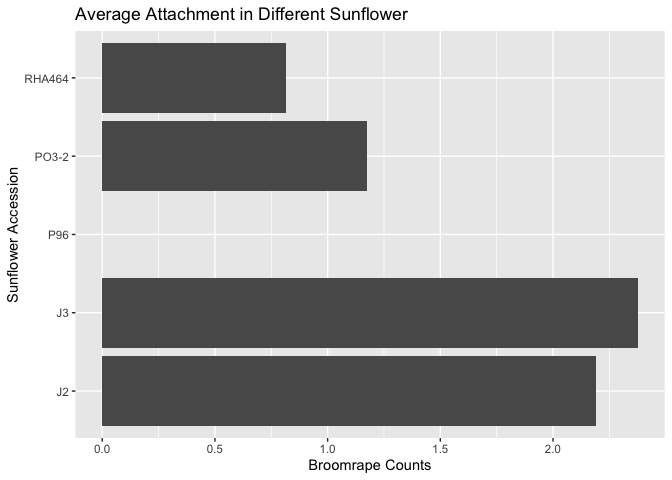

# 0. Libaries

```r
library(tidyverse)
library(shiny)
library(shinydashboard)
library(naniar)
library(janitor)
library(ggplot2)
```

# 1. Import the data

```r
broomrape <- read.csv("Table_2_Association%20mapping%20for%20broomrape%20resistance%20in%20sunflower.csv")
```


```r
#accession:Type of sunflower
#source: origin
#broomrape type_year. 2 per broomrape type measured in different year
#count: avg number of broomrapes on it.
```
# 2. Checks for NAs

```r
miss_var_summary(broomrape)
```

```
## # A tibble: 9 × 3
##   variable      n_miss pct_miss
##   <chr>          <int>    <dbl>
## 1 GT_2016            1    0.962
## 2 Accession          0    0    
## 3 Source             0    0    
## 4 GT_2017            0    0    
## 5 Bourret_2016       0    0    
## 6 Bourret_2017       0    0    
## 7 SP_2017            0    0    
## 8 SP_2018            0    0    
## 9 Confectionery      0    0
```

# 3.Clean the data column names

```r
broomrape<-
  clean_names((broomrape))
```

## remove unecessary columns

```r
broomrape <-
  broomrape %>%
  select(!confectionery)
```

## pivot data longer

```r
broomrape_long <- broomrape %>%
  pivot_longer(cols = c(3:8), names_to = "broomrape", values_to = "counts")
```

## separate broomrape type and year

```r
broomrape_sep<-
  broomrape_long %>%
  separate(broomrape, into=c("broomrape_name","year"),sep="_")
```

# 4. Find out which broomrape type is most parasitic

```r
broomrape_sep %>%
  group_by(broomrape_name) %>%
  summarise(average_count = mean(counts, na.rm = T))
```

```
## # A tibble: 3 × 2
##   broomrape_name average_count
##   <chr>                  <dbl>
## 1 bourret                 22.5
## 2 gt                      23.4
## 3 sp                      12.1
```
## Plot construction

```r
broomrape_sep %>%
  group_by(broomrape_name) %>%
  summarise(average_count = mean(counts, na.rm = T)) %>%
  ggplot(aes(x=broomrape_name, y=average_count))+
  geom_col()+
  labs(title = "Average Attachment for Each Broomrape Type",
    x="Broomrape Names",
    y="Broomrape Counts")
```

<!-- -->

# 5. Find out which host plant is most resistant

```r
broomrape_sep %>%
  group_by(accession) %>%
  summarise(ave_attachment = mean(counts, na.rm = T)) %>%
  arrange(ave_attachment)
```

```
## # A tibble: 104 × 2
##    accession ave_attachment
##    <chr>              <dbl>
##  1 P96                0    
##  2 RHA464             0.817
##  3 PO3-2              1.18 
##  4 J2                 2.19 
##  5 J3                 2.38 
##  6 PO7-13             2.86 
##  7 PO7-61             3.34 
##  8 PO7-34             4.28 
##  9 PO7-38             4.42 
## 10 PO7-63             4.55 
## # ℹ 94 more rows
```
## constructing plot

```r
broomrape_sep %>%
  group_by(accession) %>%
  summarise(ave_attachment = mean(counts, na.rm = T)) %>%
  arrange(ave_attachment) %>%
  top_n(-5) %>%
  ggplot(aes(x=accession , y=ave_attachment))+
  geom_col()+
  coord_flip()+
  labs(title = "Average Attachment in Different Sunflower",
    x="Sunflower Accession",
    y="Broomrape Counts")
```

```
## Selecting by ave_attachment
```

<!-- -->
# Looking at the distinct accessions in the data

```r
distinct(broomrape_long,accession)
```

```
## # A tibble: 104 × 1
##    accession
##    <chr>    
##  1 BP       
##  2 ADV      
##  3 97A7     
##  4 CT       
##  5 OJQ      
##  6 SAB      
##  7 92A6     
##  8 2603RM   
##  9 2603     
## 10 OV       
## # ℹ 94 more rows
```
# Shiny app. Our data was super diverse in terms of the number of different plants that had broomrapes on them. We want to compare the counts of different broomrapes based on what plant they were on.

```r
ui <- fluidPage(
  titlePanel("Broomrape Data Visualization"),
  sidebarLayout(
    sidebarPanel(
      selectInput("source", "Select site of experiment:",
                  choices = unique(broomrape_sep$source)),
      selectInput("accessions", "Select Accessions (Plant that hosted the broomrape):",
                  choices = NULL, multiple = TRUE)
    ),
    mainPanel(
      plotOutput("plot")
    )
  )
)

# Define server logic
server <- function(input, output, session) {
  
  # Update choices for accessions based on selected source
  observe({
    updateSelectInput(inputId = "accessions",
                      choices = unique(broomrape_sep$accession[broomrape_sep$source == input$source]))
  })
  
  # Filter data based on user input
  filtered_data <- reactive({
    broomrape_sep %>%
      filter(source == input$source) %>%
      filter(accession %in% input$accessions)
  })
  
  # Render scatter plot
  output$plot <- renderPlot({
    ggplot(filtered_data(), aes(x = accession, y = counts, fill = factor(year))) +
      geom_point(shape = 21, size = 4, position = position_dodge(width = 0.5)) +
      labs(title = paste("Counts for", input$source),
           x = "Host Plant", y = "Count of Broomrapes (on Avg)") +
      scale_fill_discrete(name = "Year") +  # Set legend title
      theme_bw() # Use a white background theme
  })
}

# Run the application
shinyApp(ui = ui, server = server)
```

```{=html}
<div style="width: 100% ; height: 400px ; text-align: center; box-sizing: border-box; -moz-box-sizing: border-box; -webkit-box-sizing: border-box;" class="muted well">Shiny applications not supported in static R Markdown documents</div>
```


