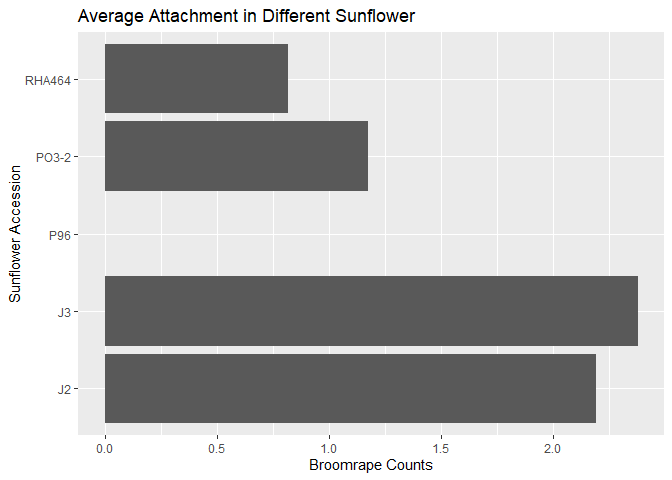

# 0. Libaries

```r
library(tidyverse)
library(shiny)
library(shinydashboard)
library(naniar)
library(janitor)
library(ggplot2)
```

# 1. Import the data

```r
broomrape <- read.csv("Table_2_Association%20mapping%20for%20broomrape%20resistance%20in%20sunflower.csv")
```


```r
#accession:Type of sunflower
#source: origin
#broomrape type_year. 2 per broomrape type measured in different year
```
# 2. Checks for NAs

```r
miss_var_summary(broomrape)
```

```
## # A tibble: 9 × 3
##   variable      n_miss pct_miss
##   <chr>          <int>    <dbl>
## 1 GT_2016            1    0.962
## 2 Accession          0    0    
## 3 Source             0    0    
## 4 GT_2017            0    0    
## 5 Bourret_2016       0    0    
## 6 Bourret_2017       0    0    
## 7 SP_2017            0    0    
## 8 SP_2018            0    0    
## 9 Confectionery      0    0
```

# 3.Clean the data column names

```r
broomrape<-
  clean_names((broomrape))
```

## remove unecessary columns

```r
broomrape <-
  broomrape %>%
  select(!confectionery)
```

## pivot data longer

```r
broomrape_long <- broomrape %>%
  pivot_longer(cols = c(3:8), names_to = "broomrape", values_to = "counts")
```

## separate broomrape type and year

```r
broomrape_sep<-
  broomrape_long %>%
  separate(broomrape, into=c("broomrape_name","year"),sep="_")
```

# 4. Find out which broomrape type is most parasitic

```r
broomrape_sep %>%
  group_by(broomrape_name) %>%
  summarise(average_count = mean(counts, na.rm = T))
```

```
## # A tibble: 3 × 2
##   broomrape_name average_count
##   <chr>                  <dbl>
## 1 bourret                 22.5
## 2 gt                      23.4
## 3 sp                      12.1
```
## Plot construction

```r
broomrape_sep %>%
  group_by(broomrape_name) %>%
  summarise(average_count = mean(counts, na.rm = T)) %>%
  ggplot(aes(x=broomrape_name, y=average_count))+
  geom_col()+
  labs(title = "Average Attachment for Each Broomrape Type",
    x="Broomrape Names",
    y="Broomrape Counts")
```

<!-- -->

# 5. Find out which host plant is most resistant

```r
broomrape_sep %>%
  group_by(accession) %>%
  summarise(ave_attachment = mean(counts, na.rm = T)) %>%
  arrange(ave_attachment)
```

```
## # A tibble: 104 × 2
##    accession ave_attachment
##    <chr>              <dbl>
##  1 P96                0    
##  2 RHA464             0.817
##  3 PO3-2              1.18 
##  4 J2                 2.19 
##  5 J3                 2.38 
##  6 PO7-13             2.86 
##  7 PO7-61             3.34 
##  8 PO7-34             4.28 
##  9 PO7-38             4.42 
## 10 PO7-63             4.55 
## # ℹ 94 more rows
```
## constructing plot

```r
broomrape_sep %>%
  group_by(accession) %>%
  summarise(ave_attachment = mean(counts, na.rm = T)) %>%
  arrange(ave_attachment) %>%
  top_n(-5) %>%
  ggplot(aes(x=accession , y=ave_attachment))+
  geom_col()+
  coord_flip()+
  labs(title = "Average Attachment in Different Sunflower",
    x="Sunflower Accession",
    y="Broomrape Counts")
```

```
## Selecting by ave_attachment
```

<!-- -->

